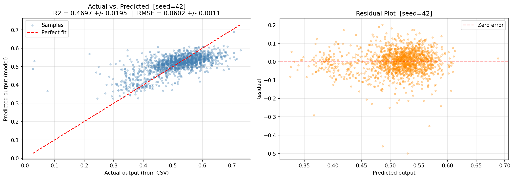
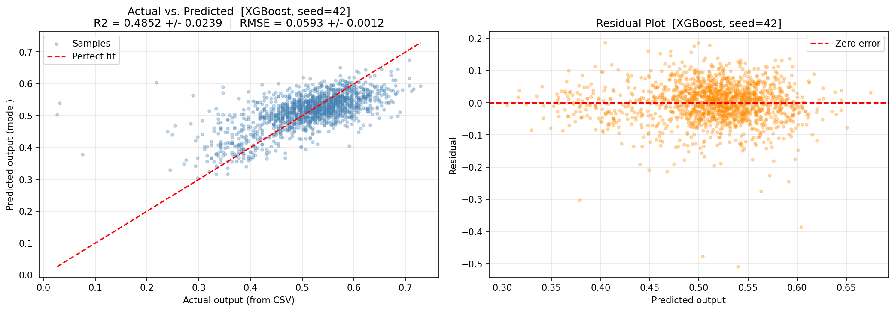

# Project Submission Report

## Project Title
Project 1 - Steel Production Data

### Abstract

In this project, a regression Model was trained to predict a quality parameter in steel production from 21 normalized input parameters. Two approaches were compared — Random Forest and XGBoost — evaluated over 10 runs each. Random Forrest reached a mean R² of 0.47 ± 0.02 and RMSE of 0.060 ± 0.001; XGBoost reached R² of 0.49 ± 0.02 and RMSE of 0.059 ± 0.001.

### Introduction

A precise quality prediction is very valuable in industrial production factories, because it makes it possible to detect out-of-spec products early, reduce waste etc. The dataset which was used here contains measurement data, where each row stands for one production sample with a known quality outcome. By training a modell on this data, it should be possible to estimate the quality of a new sample only from its measurements.

**Objectives**

- Load and inspect a normalized dataset
- Train a regressions-modell that can predict the quality output parameter from 21 input parameters.
- Evaluate how well the model performs using standard statistical metrices (R² and RMSE).
- Visualize the results to better understand where the model works well and where it struggles.

---

## Methods

**Data Acquisition**

The dataset used in this project was proivded as part of the course. It consists of two CSV-tables — a training set and a test set — which are located in the `data/processed/` folder:

- `normalized_train_data.csv` — used to train the modell
- `normalized_test_data.csv` — used for evaluation/testing

Each file is consisting of 22 columns: one output column called `output` (which represents the quality parameter) and 21 input columns named `input1` through `input21`. All values were already normalized to a range between 0 and 1.

**Data Analysis**

The analysis was done in the following steps:

**Step 1 – Splitting the data**
To obtain a reliable performance estimate, the dataset was split into a training set (80%) and a test set (20%) across 10 runs, each using a different random seed. This allows mean and standard deviation to be reported instead of a single point estimate. For the measurement of the model performance, two metrics were used:

- **R² (R-squared):** Tells how much of the variation in the output the modell is able to explain. A value of 1.0 means perfect prediction; 0.0 means the model is no better than just always guessing the average value.
- **RMSE (Root Mean Squared Error):** The average size of the prediction error, expressed in the same units as the output. Lower is better.

**Step 2 – Creating and Training Random Forrest model**
Random Forrest Modell was created and trained — a method that builds many decision trees from random subsets of the data and averages their predictions. It works well on tabular data without much configuration.

**Step 3 – Writing a test class**

After the training, a test class of 9 test cases was written to verify data integrity, correct modell training, and minimum prediction quality. The Random Forest reached an R² of approximately 0.43, meaning that 57% of the variance in the output remained unexplained. After trying several variations of the Random Forrest model the problem remained.

**Step 4 – XGBoost as an alternative**
To investigate whether a more powerful modell could improve this, XGBoost (Extreme Gradient Boosting) was modelled as a second approach. XGBoost builds trees one afetr another, where each new tree specifically tries to correct the mistakes of all the trees before. However, XGBoost also reached an R² of approximately 0.43 — the same result as the Random Forrest.

**Step 5 – Investigation of the low R² value**
Since no model was able to improve the score, the data itself was looked at more closely. The output column turned out to have a very narrow value range — its standard deviation is only about 0.083, meaning that almost all quality values are lying tightly around the average of 0.51.
This is the actual reason for the low R²: because the target values are barely varying, even small absolute prediction errors appear large in relative terms, which pulls the R² score down.
The RMSE, which measures the absolute error, stays well below 0.1 for both modells, what confirms that the predictions are in fact numerically close to the true values.
Annotation: Since both models produced identical R² scores, writing separate test cases for each would have been redundant.

**Tools Used**

| Tool | Purpose |
|---|---|
| Python 3.14 | Programming language |
| pandas | Loading and handling the CSV data |
| numpy | Numerical calculations |
| scikit-learn | Random Forrest, train/test split, metrics |
| XGBoost | XGBoost regression model |
| matplotlib | Plotting graphs |
| Jupyter Notebook | Interactive coding environment |
| pytest / unittest | Automated testing of the model |

---

## Results

Both models were evaluated over 10 runs using different random seeds, each with an 80/20 train/test split. Mean and standard deviation were computed across all runs to provide a reliable performance estimate.

**Evaluation Metrics**

Two standard regression metrics were used to assess model quality:

- **R² (Coefficient of Determination):** Measures what proportion of the variance in the output the model is able to explain. It is an appropriate metric for regression tasks because it provides a scale-independent measure of fit. A value of 1.0 indicates a perfect prediction; 0.0 means the model performs no better than always predicting the mean.
- **RMSE (Root Mean Squared Error):** Measures the average absolute prediction error in the same unit as the output variable. It is used alongside R² because it is independent of output variance and therefore provides a direct, interpretable measure of prediction accuracy — which is particularly relevant in this dataset where the output has a very narrow value range (SD ≈ 0.083).

**Model Performance**

To obtain a reliable performance estimate, the Random Forest model was trained and evaluated 10 times using different random seeds (0, 1, 7, 13, 21, 42, 55, 77, 88, 99). Each run used a different train/test split and a different model initialization. Mean and standard deviation were computed across all 10 runs.

| Model | R² Mean ± SD | RMSE Mean ± SD | Runs |
|---|---|---|---|
| Random Forest | 0.4697 ± 0.0195 | 0.0602 ± 0.0011 | 10 |
| XGBoost | 0.4852 ± 0.0239 | 0.0593 ± 0.0012 | 10 |

Both models were evaluated over 10 runs using different random seeds. The low standard deviations confirm that the results are stable across different data splits. XGBoost reached a slightly higher mean R² (0.485 vs. 0.470) and a slightly lower RMSE (0.059 vs. 0.060), though the difference is within one standard deviation and not practically significant. The R² values appear low but are a direct consequence of the very small output variance (SD ≈ 0.083): because the total variance SS_total is small, even numerically small residuals produce a large ratio SS_res / SS_total, which lowers R². The RMSE below 0.060 for both models is smaller than the natural standard deviation of the output (0.083), confirming that the model predictions are closer to the true values than a mean prediction would be.

**Visualizations**

The following plots were generated by `steelproduction.ipynb` and `steelproduction_v2.ipynb` and saved to `results/figures/`.

*Figure 1 – Actual vs. Predicted values (Random Forrest)*

Each point represents one sample from the test set. The x-axis shows the true output value and the y-axis shows the predicted value. A perfect model would place all points on the red diagonal line. The spread around the line reflects the typical prediction error.

*Figure 2 – Actual vs. Predicted values (XGBoost)*

**Limitations**

- **Unexplained variance:** The mean R² is approximately 0.47–0.49 for both models, which suggests that a significant part of the variation in quality cannot be explained by the available input parameters alone. Additional factors not captured in the dataset may play a role.
- **No k-fold cross-validation:** Although 10 runs with different random seeds were performed, the test sets across runs can overlap. A proper k-fold cross-validation would ensure that every sample appears in the test set exactly once, providing a more rigorous and exhaustive performance estimate.
- **No outlier analysis:** Potential outliers in the input columns were not investigated or removed. Outliers can affect model training and may have influenced the results.

---

## Conclusion

In this project, not one but two machine learning models were built and evaluated that should predict a steel production quality parameter from 21 normalized input measurements. Both did not yeald a high R² value, which is an indicator of how well the model fit the data.

Only after analysis of the dataset could it be determined, that the problem was not in the model but rather the set benchmark/quality parameter. This was definitely an oversight in the planing stage of the model building and could've been rectified by analyzing the data more throughly rather than settling on just one parameter. 
The second model was in hindsight redundant but now serves as validation: two fundamentally different algorithms reaching the same result confirms that the low R² is a property of the dataset, not of the model.

Future improvements could include a thorough outlier analysis of the input columns, since undetected outliers can distort model training and reduce prediction accuracy. Additionally, applying k-fold cross-validation instead of a single train/test split would provide a more reliable estimate of the model's true performance across different subsets of the data.

---

## Acknowledgments

This project was developed with the assistance of claude.ai. The following prompts were used during development:

- *"Welche Regressionsmodelle gibt es und welches würde gut für einen Output-Parameter und 21 Input-Parameter passen?"*
- *"Was sind zusätzliche Test-Cases für dieses Modell?"*
- *"Was ist der Unterschied zwischen RandomForest und XGBoost?"*
- *"Wie kann es sein, dass der R²-Wert niedrig ist, obwohl der RMSE gut ist?"*

**References:**

- Random Forrest algorithm: [https://scikit-learn.org/stable/modules/ensemble.html#random-forests](https://scikit-learn.org/stable/modules/ensemble.html#random-forests)
- XGBoost algorithm: [https://xgboost.readthedocs.io/en/stable/tutorials/model.html](https://xgboost.readthedocs.io/en/stable/tutorials/model.html)
- Coefficient of determination (R²) — formula definition and mathematical properties: [https://en.wikipedia.org/wiki/Coefficient_of_determination](https://en.wikipedia.org/wiki/Coefficient_of_determination)

