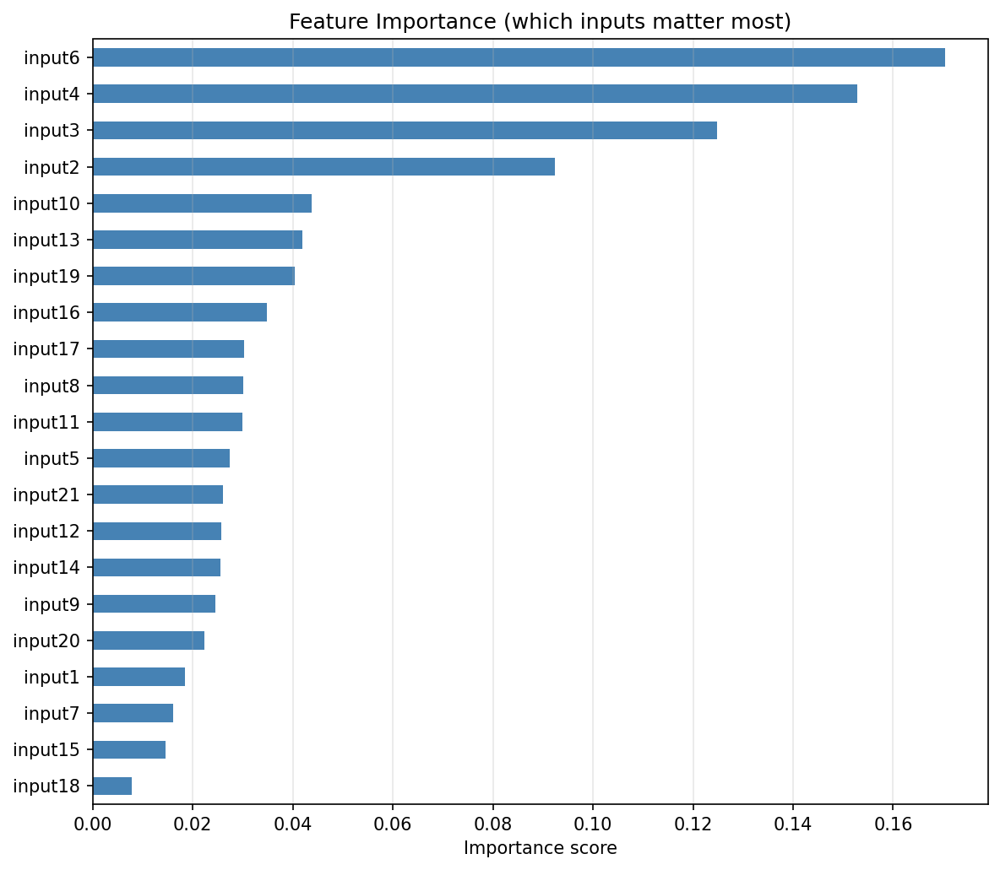

# Project Submission Report

## Project Title
Project 1 - Steel Production Data

### Abstract

In this project, a regression Model was trained to predict a quality parameter in steel production from 21 normalized input parameters. Two approaches were compared — Random Forrest and XGBoost — and both reached an R² of around 0.43 on the test set.

### Introduction

A precise quality prediction is very valuable in industrial production factories, because it makes it possible to detect out-of-spec products early, reduce waste etc. The dataset which was used here contains measurement data, where each row stands for one production sample with a known quality outcome. By training a modell on this data, it should be possible to estimate the quality of a new sample only from its measurements.

**Objectives**

- Load and inspect a normalized dataset
- Train a regressions-modell that can predict the quality output parameter from 21 input parameters.
- Evaluate how well the model performs using standard statistical metrices (R² and RMSE).
- Visualize the results to better understand where the model works well and where it struggles.

---

## Methods

**Data Acquisition**

The dataset used in this project was proivded as part of the course. It consists of two CSV-tables — a training set and a test set — which are located in the `data/processed/` folder:

- `normalized_train_data.csv` — used to train the modell
- `normalized_test_data.csv` — used for evaluation/testing

Each file is consisting of 22 columns: one output column called `output` (which represents the quality parameter) and 21 input columns named `input1` through `input21`. All values were already normalized to a range between 0 and 1.

**Data Analysis**

The analysis was done in the following steps:

**Step 1 – Splitting the data**
As a first step, the dataset was split into a training set (80%) and a test set (20%) with a fixed random seed (`random_state=18`) to make the results reproducible. That means the same split is used every time the code is run, so results can always be compared in a fair way. For the measurement of the model performance, two metrics were used:

- **R² (R-squared):** Tells how much of the variation in the output the modell is able to explain. A value of 1.0 means perfect prediction; 0.0 means the model is no better than just always guessing the average value.
- **RMSE (Root Mean Squared Error):** The average size of the prediction error, expressed in the same units as the output. Lower is better.

**Step 2 – Creating and Training Random Forrest model**
Random Forrest Modell was created and trained — a method that builds many decision trees from random subsets of the data and averages their predictions. It works well on tabular data without much configuration and was therefore a good starting point. 

**Step 3 – Writing a test class**

After the training, a test class of 9 test cases was written to verify data integrity, correct modell training, and minimum prediction quality. The Random Forest reached an R² of approximately 0.43, meaning that 57% of the variance in the output remained unexplained. After several variations of the Random Forrest model the problem remained.

**Step 4 – XGBoost as an alternative**
To investigate whether a more powerful modell could improve this, XGBoost (Extreme Gradient Boosting) was modelled as a second approach. XGBoost builds trees one afetr another, where each new tree specifically tries to correct the mistakes of all the trees before. However, XGBoost also reached an R² of approximately 0.43 — the same result as the Random Forrest.

**Step 5 – Investigation of the low R² value**
Since no model was able to improve the score, the data itself was looked at more closely. The output column turned out to have a very narrow value range — its standard deviation is only about 0.083, meaning that almost all quality values are lying tightly around the average of 0.51.
This is the actual reason for the low R²: because the target values are barely varying, even small absolute prediction errors appear large in relative terms, which pulls the R² score down.
The RMSE, which measures the absolute error, stays well below 0.1 for both models, what confirms that the predictions are in fact numerically close to the true values.
Annotation: Since both models produced identical R² scores, writing separate test cases for each would have been redundant. The visualisations in the Results section therefore show the Random Forrest modell only, as it is the primary model.

**Tools Used**

| Tool | Purpose |
|---|---|
| Python 3.14 | Programming language |
| pandas | Loading and handling the CSV data |
| numpy | Numerical calculations |
| scikit-learn | Random Forrest, train/test split, metrics |
| XGBoost | XGBoost regression model |
| matplotlib | Plotting graphs |
| Jupyter Notebook | Interactive coding environment |
| pytest / unittest | Automated testing of the model |

---

## Results

**Findings**

Both models were trained on the same dataset and evaluated on the same test set. The results are summarized in the table below:

| Model | R² Score | RMSE |
|---|---|---|
| Random Forrest | 0.43 | < 0.1 |
| XGBoost | 0.43 | < 0.1 |

Both models reached the same performance with an R² of 0.43 and an RMSE below 0.1.

The R² of 0.43 means the model explains about 43% of the variation in the output. This looks low, but the reason is that the output values in this dataset are already very close together — the standard deviation is only about 0.083. Because of this, even small prediction errors lead to a low R² value. This is a mathematical property of the metric and does not mean the modell is inaccurate.

The RMSE measures the average prediction error directly and is not affected by this. With RMSE < 0.1, the predictions are numerically close to the true values — notably, the prediction error is smaller than the natural standard deviation of the output (~0.083), which confirms that the modell adds predictive value. In the automated tests, a minimum threshold of R² ≥ 0.30 was set as a conservative lower bound relative to the observed ceiling of ~0.43, and both models are above it.

**Visualizations**

The following plots were generated by `steelproduction.ipynb` and saved to `results/figures/`.

*Figure 1 – Actual vs. Predicted values (Random Forrest)*

Each point represents one sample from the test set. The x-axis shows the true value and the y-axis shows the predicted value. A perfect modell would place all points on the red diagonal line. The spread around the line shows the typical prediction error.

*Figure 2 – Feature Importance (Random Forrest)*

This chart shows which input columns had the most influence on the model's predictions. The importance score is based on the average reduction in impurity (Gini impurity) achieved by splits on that feature across all trees. A longer bar means the feature contributed more to reducing prediction uncertainty, and therefore carries more information about the quality outcome.

**Limitations**

The R² is limited to around 0.43 for both models, which suggests that some variation in the output cannot be explained by the available inputs alone. Additional factors not captured in the dataset may play a role. The feature names (`input1` to `input21`) have no descriptions, so it is not possible to say what they physically represent. Since all values are normalized, the original units are also not known.

---

## Conclusion

In this project, two machine learning models were successfully built and evaluated that predict a steel production quality parameter from 21 normalized input measurements. The Random Forrest Model was selected as the primary modell and reached an R² of approximately 0.43 and an RMSE below 0.1 on the test set. Even though the R² score looks low, it stands in connection with the low variance of the target variable and is confirmed by the low absolute prediction error. An automated test suite with 9 test cases was implemented to verify data integrity, model training and prediction quality. For future work it would make sense to look at additional feature engineering, larger datasets or more advanced tuning to push the model-performance further.

---

## Acknowledgments

This project was developed with the assistance of **Claude** (claude.ai). The following prompts were used during development:

- *"Welche Regressionsmodelle gibt es und welches würde gut für einen Output-Parameter und 21 Input-Parameter passen?"*
- *"Was sind zusätzliche Test-Cases für dieses Modell?"*
- *"Was ist der Unterschied zwischen RandomForest und XGBoost?"*
- *"Wie kann es sein, dass der R²-Wert niedrig ist, obwohl der RMSE gut ist?"*

**References:**

- Random Forrest algorithm: [https://scikit-learn.org/stable/modules/ensemble.html#random-forests](https://scikit-learn.org/stable/modules/ensemble.html#random-forests)
- XGBoost algorithm: [https://xgboost.readthedocs.io/en/stable/tutorials/model.html](https://xgboost.readthedocs.io/en/stable/tutorials/model.html)
- Coefficient of determination (R²) — formula definition and mathematical properties: [https://en.wikipedia.org/wiki/Coefficient_of_determination](https://en.wikipedia.org/wiki/Coefficient_of_determination)

